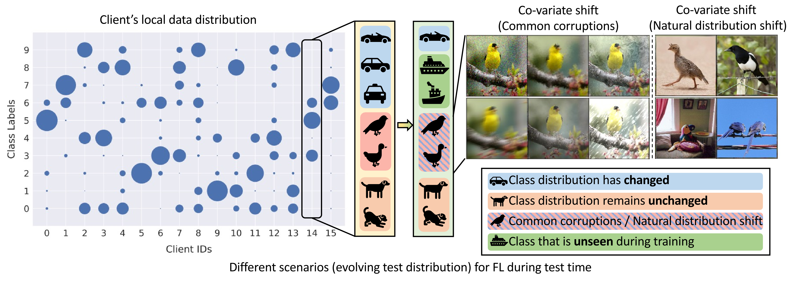

# Test-time Robust Personalization for Federated Learning
[Liangze Jiang*](https://liangzejiang.github.io/), [Tao Lin*](https://tlin-taolin.github.io/)

[`arXiv`](https://arxiv.org/abs/2205.10920) | [`BibTeX`](#bibliography)

This is an official PyTorch implementation of the paper **Test-Time Robust Personalization for Federated Learning (ICLR 2023)**. In this work, we:

- Identify the importance of robustifying Federated Learning (FL) models under the evolving local test set during deployment.
- Construct a [`benchmark (BRFL)`](#the-benchmark-for-robust-fl) for effectively evaluating the Out-of-Distribution (OOD) robustness of FL algorithms.
- Propose a novel Test-time Head Ensemble method for FL (`FedTHE`/`FedTHE+`) that conducts adaptive and robust personalization for advanced In-distribution (ID)/OOD performance.

## Abstract

<p align="center">

</p>

Federated Learning (FL) is a machine learning paradigm where many clients collaboratively learn a shared global model with decentralized training data. Personalization on FL model additionally adapts the global model to different clients, achieving promising results on consistent local training & test distributions. However, for real-world personalized FL applications, it is crucial to go one step further: robustifying FL models under the evolving local test set during deployment, where various types of distribution shifts can arise.

In this work, we identify the pitfalls of existing works under test-time distribution shifts and propose Federated Test-time Head Ensemble plus tuning (FedTHE+), which personalizes FL models with robustness to various test-time distribution shifts. We illustrate the advancement of FedTHE+ (and its degraded computationally efficient variant FedTHE) over strong competitors, for training various neural architectures (CNN, ResNet, and Transformer) on CIFAR10 and ImageNet and evaluating on diverse test distributions. Along with this, we build a benchmark for assessing the performance and robustness of personalized FL methods during deployment.

## Usage
### Requirements
To distribute FL clients over GPUs and do local training efficiently, this codebase is based on PyTorch with MPI backend for a Master-Worker computation/communication topology. We rely on [`env/Dockerfile`](env/Dockerfile) to manage the environment.

Please do `docker pull ljiang98/fedthe_iclr2023:latest` for an image built from the above Dockerfile, if it's not convenient for you to build the image locally.
### How to Run
The main entry point of a single experiment is [`main.py`](main.py). To facilitate experiments running, we provide [`scripts`](exps/) for running the bulk experiments in the paper. For example, to run `FedTHE`/`FedTHE+` and other baselines on CIFAR10 with CNN (Tab. 1), you can run the following command:
```
python run_exps.py --script_path exps/exp_cifar10_cnn.py
```
For other architectures, simply do:
```
python run_exps.py --script_path exps/exp_cifar10_cct.py
python run_exps.py --script_path exps/exp_cifar10_resnet.py
```
For running on ImageNet with ResNet, you can run the following:
```
python run_exps.py --script_path exps/exp_imagenet_resnet.py
```

## The Benchmark for Robust FL
This repo also contains a separated [`codebase`](BRFL/) for the **B**enchmark for **R**obust **FL** (BRFL), for the ease of reusing.

The benchmark currently employs CIFAR10 and ImageNet32 (downsampled ImageNet) as base datasets, and constructs various test distributions by applying different types of distribution shifts, including:

- In-distribution (ID) test set
- Co-variate distribution shift (e.g., the Common Corruptions CIFAR10-C)
- Label distribution shift
- Natural distribution shift (e.g., CIFAR10.1)
- Mixture of tests: the mixture of the above ID/OOD test distributions.


For each client, the benchmark creates the above 5 ID/OOD test sets in different dataloaders. For more details, please see [`BRFL/README.md`](BRFL/README.md) or Sec. 5 of our paper.
## Bibliography
If you find this repository helpful for your project, please consider citing our work:

```
@inproceedings{jiang2023test,
  title={Test-Time Robust Personalization for Federated Learning},
  author={Jiang, Liangze and Lin, Tao},
  booktitle = {International Conference on Learning Representations (ICLR)},
  year={2023}
}
```