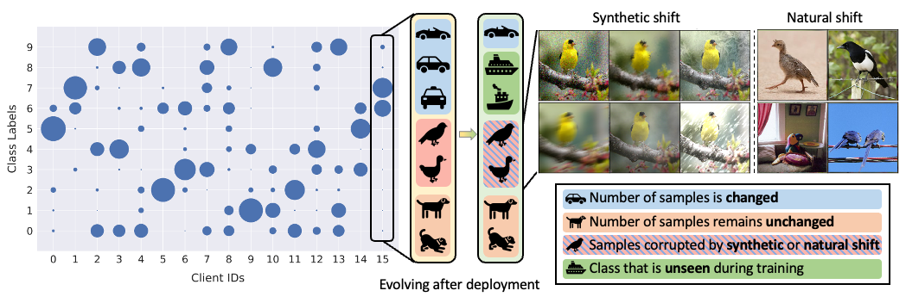

# Test-Time Robust Personalization for Federated Learning

This repository contains the code for the main experiments in the paper: Test-time Robust Personalization for Federated Learning.

## Introduction


For real-world federated learning (FL) applications, the test sets on each client are inevitably evolving during deployment,
where various types of distribution shifts can arise.
We introduce a test-time robust personalization method
named Federated Test-time Head Ensemble plus Tuning (FedTHE+) to tackle it. Our FedTHE+ and its degraded but much more
computational efficient variant FedTHE demonstrates significant performance and robustness gains on various test distributions
(including In-Distribution and Out-of-Distributions).

As a side contribution, we come up with a benchmark to assess the robustness and performance for FL models.

## Requirements
This project is relied on `Docker` and `Kubernetes`.
For the detailed experimental environment setup, please refer to dockerfile under the `environments` folder.

Extra requirements can be installed by `sh extra_requirement.sh` under `fl_code/`

## How to run

After preparing the evironments and installing the requirements, you can run the experiments by,
for example, executing `python3 run_exps.py` under `./fl_code`. This will use the default parameters in
`./fl_code/parameters.py` and the replaced parameters in `./fl_code/exps/your_example.py`.

The folder `./fl_code/exps/` shows some common examples for different methods, architectures and datasets, 
and you may change the `--script_path` to your own example.

## Project Structure
```
.
├── fl_code              # Codes
│   ├── exps         	       # Experimental scripts
|   ├── pcode                  # The main FL codes
│       ├── aggregation        # Global aggregation algorithms (e.g FedAvg)
│       ├── datasets           # Data-related
│       ├── local_training     # Implementation for different FL algorithms
│       ├── models             # Collection of model architetures
│       ├── master.py          # Server
│       ├── worker.py          # Client
│       └── ...                # Creaters for different hyper-components and helper functions
├── environments         # Config for Kubernetes and Docker
└── README.md                  # This file
```

